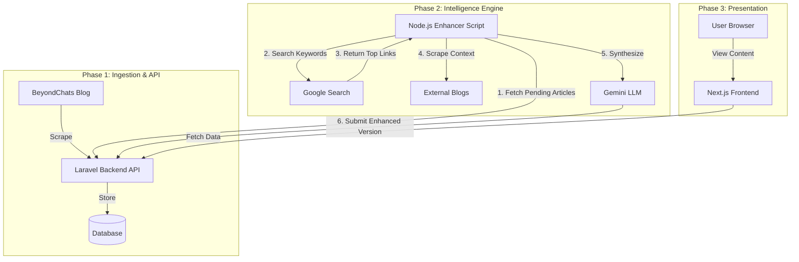

# BeyondChats Article Enhancer Suite

Welcome to the **BeyondChats Article Enhancer**, a sophisticated full-stack solution designed to scrape, intelligently reference, and rewrite blog articles using Generative AI. This project demonstrates a hybrid microservices-inspired architecture, leveraging the best tools for each specific domain of the problem space.

## 🚀 Project Overview & Architecture

This solution is engineered in three distinct phases, each handled by a specialized component:

### Phase 1: The Core System (Laravel Backend)
**Goal:** Scrape base content and serve it via API.
We utilize **Laravel 12** for the backend. Why?
- **Robustness:** Laravel provides an enterprise-grade structure for "Data Management."
- **Rapid Development:** Its powerful Eloquent ORM and API Resources allow us to set up secure CRUD endpoints in minutes.
- **Scraping Capabilities:** Using `Guzzle` and `Symfony DOM Crawler` within Laravel's robust command/seeder structure allows us to reliably fetch the initial batch of articles from BeyondChats.

### Phase 2: The Intelligence Engine (Node.js Enhancer)
**Goal:** Enhance content with external knowledge.
We utilize a standalone **Node.js** script. Why?
- **Async I/O:** Node.js is the industry standard for IO-heavy operations. The enhancement process involves multiple concurrent network requests: Google Search, scraping external sites (via Cheerio), and streaming data to the Gemini LLM.
- **Ecosystem:** The Node.js ecosystem (Cheerio, Google Generative AI SDK) offers the most mature tools for this specific "glue" logic.

### Phase 3: The Presentation Layer (Next.js Frontend)
**Goal:** Display the results professionally.
We utilize **Next.js 16 (React 19)**. Why?
- **Beyond Basic React:** While a standard React app was requested, we upgraded to Next.js to ensure **SEO Performance**. Since we are dealing with articles, Server-Side Rendering (SSR) is crucial for discoverability.
- **UX & Performance:** Next.js offers automatic code splitting and image optimization, providing a "premium" feel (smooth transitions, fast loads) that raw React requires significant manual effort to match.

---

## 📐 Data Flow Diagram



---

## 🛠️ Local Setup Instructions

Follow these steps to get the entire suite running locally.

### Prerequisites
- **PHP** >= 8.2 & **Composer**
- **Node.js** >= 20 & **npm**
- **Database** (SQLite, MySQL, or PostgreSQL)

### 1. Backend Setup (Laravel)
The backend manages the data and the initial scraping of BeyondChats.

```bash
cd backend
composer install
cp .env.example .env
# Edit .env to set your database credentials (DB_DATABASE, etc.)
php artisan key:generate
php artisan migrate
# This seeder fetches the initial articles from BeyondChats
php artisan db:seed 
php artisan serve
```
*Backend will run at `http://localhost:8000`*

### 2. Enhancer Setup (Node.js)
The script that "humanizes" and enhances the articles.

```bash
cd ../enhancer
npm install
# Create a .env file with your Google Gemini API Key
echo "GEMINI_API_KEY=your_key_here" > .env
node index.js
```
*This script runs as a process. It fetches articles from the backend, enhances them, and updates them.*

### 3. Frontend Setup (Next.js)
The modern UI to view the articles.

```bash
cd ../frontend
npm install
# Ensure .env.local points to your Laravel Backend
echo "NEXT_PUBLIC_API_URL=http://localhost:8000/api" > .env.local
npm run dev
```
*Frontend will run at `http://localhost:3000`*

---

## 🌟 Key Features
- **Hybrid Scraping**: Combines PHP-based DOM scraping for reliability with Node.js-based dynamic scraping for speed.
- **AI-Powered Rewrite**: Updates content while maintaining the original tone, fixing grammar, and adding relevant context.
- **Reference Citation**: Automatically appends citations from the Google Search results used to enhance the article.
- **Responsive UI**: A beautiful, mobile-first interface built with Tailwind CSS and Framer Motion.

## 📁 Repository Structure
- `/backend` - Laravel API & Scraper
- `/enhancer` - Node.js Intelligence Script
- `/frontend` - Next.js User Interface

## 🌐 Live Link
- **Frontend & Admin:** [https://beyondchats-assignment.railway.app](https://beyondchats-assignment.railway.app)
- **API Documentation:** [https://beyondchats-assignment.railway.app/api/documentation](https://beyondchats-assignment.railway.app/api/documentation)